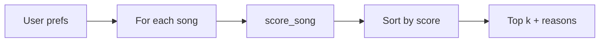
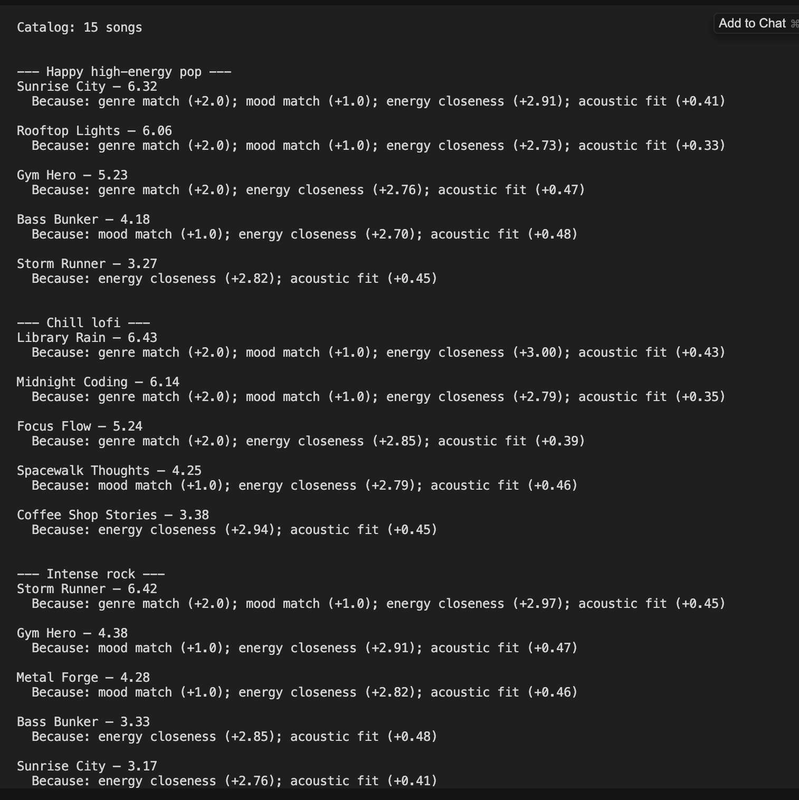

# Music Recommender Simulation

## Project Summary

I built a **content-based** recommender: each song row gets a **weighted score** from my prefs (genre, mood, energy, acoustic taste), then I **sort** and show the top *k*. 

---

## How The System Works

**Real apps (e.g. Spotify)** blend **collaborative** signals (“people like you listened…”) with **content** features (tempo, mood). **My version** is **content-only**: I only read the CSV attributes I coded for.

**Features I use**

- **Song (CSV / `Song`):** genre, mood, energy, tempo_bpm, valence, danceability, acousticness (tempo/valence/danceability load but are not scored yet).
- **User prefs:** `genre`, `mood`, `energy`, optional `likes_acoustic` (CLI dict). **`UserProfile`** maps to the same dict for tests.

**Scoring (high level)**

- Genre substring match → **+2.0** (so `pop` can match `indie pop`).
- Mood exact (case-insensitive) → **+1.0**.
- Energy → **3.0 × (1 − |song_energy − target|)** so **closer** beats “always louder.”
- Acoustic → small nudge toward high `acousticness` if `likes_acoustic`, else toward lower.

**Flow**



---

## Getting Started

```bash
python3 -m venv .venv
source .venv/bin/activate
pip install -r requirements.txt
python -m src.main
pytest
```

---

## Experiments

- I ran **three profiles** in `src/main.py` (happy pop, chill lofi, intense rock) and checked the printed top 5.

### CLI output

Run: `python -m src.main`



---

## Limitations and Risks

- **Tiny catalog** → repeated winners, easy **filter bubble** if weights favor one genre.
- **No lyrics, language, or listening history** → misses why humans like a track.
- **“Metal” ≠ “rock”** in my tags → a “rock” user might miss close neighbors unless I add fuzzy genre groups.

Deeper bias notes: [`model_card.md`](model_card.md).

---

## Reflection

I learned that **transparent rules** still “feel” like recommendations because ranking is easy to narrate—but they also **encode my weight choices** as bias. See in [`model_card.md`](model_card.md) and [`reflection.md`](reflection.md).
