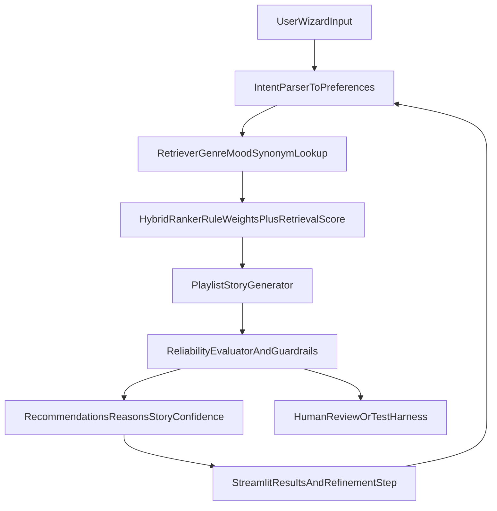
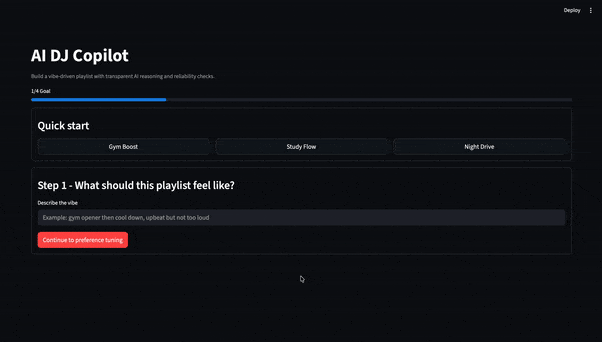

# AI DJ Copilot

AI DJ Copilot is an applied AI music recommendation system that combines a transparent ranker, retrieval-enhanced candidate selection, and a narrative playlist story generator. It is packaged as a modern Streamlit wizard UI so users can go from intent to refined playlist in a few steps.

## Base Project (Module 1-3 Lineage)

This project extends my earlier **Music Recommender Simulation** from Modules 1-3. The original version focused on deterministic, content-based scoring from CSV metadata (genre, mood, energy, acousticness) and returned top-k songs with simple reasons.  
In this final version, I redesigned it into a complete applied AI system with a Copilot flow, retrieval stage, confidence/guardrails, reliability evaluation, and portfolio-ready UI.

## Why This Matters

- Converts a static recommender into an interactive AI product flow.
- Keeps recommendations explainable with score-component breakdowns.
- Adds reliability signals so users can trust when to accept or refine output.

## System Architecture

Architecture source: [`assets/system_architecture.md`](assets/system_architecture.md)



## Core Features

- **Modern UI and flow:** Streamlit 4-step wizard with presets, validation, and refinement.
- **Copilot intent parsing:** Converts natural language intent into structured preferences.
- **RAG-lite retrieval:** Candidate songs are prioritized with genre and mood semantic expansions.
- **Transparent scoring:** Genre, mood, energy, acoustic, and retrieval contributions are exposed.
- **Playlist story:** Generates a concise narrative of the energy arc and transition logic.
- **Guardrails:** Low-confidence flag + safer defaults path.
- **Reliability tooling:** Automated evaluation script writes reproducible JSON reports.

## Setup Instructions

```bash
python3 -m venv .venv
source .venv/bin/activate
pip install -r requirements.txt
```

### Quick Demo (2 minutes)

```bash
streamlit run app.py
```

Then in the app:
- choose a preset (`Gym Boost`, `Study Flow`, or `Night Drive`),
- generate recommendations,
- read the playlist story and confidence value,
- tweak energy in Refine and regenerate once.

### Run Streamlit UI

```bash
streamlit run app.py
```

### Run CLI Demo

```bash
python -m src.main
```

### Run Tests

```bash
pytest
```

### Run Reliability Evaluation

```bash
python -m src.evaluation
```

Output artifact: `artifacts/reliability_report.json`  
Request logs: `artifacts/recommendation_log.jsonl`

## Sample Interactions

### Walkthrough Example (App UI)

**Demo video walkthrough (GIF)**


**Step 1: Select vibe and tune preferences**


**Step 2: Generate ranked recommendations**


**Step 3: Review playlist story and confidence**


### 1) Gym Boost
- **Input intent:** "gym opener then cool down, high energy"
- **Expected behavior:** intense/edm/rock-leaning top songs, high confidence, story mentions momentum arc.
- **Typical output pattern:** top tracks include high-energy songs with low acousticness.

### 2) Study Flow
- **Input intent:** "focus coding session, minimal distraction"
- **Expected behavior:** lofi/ambient-focused picks, moderate energy, acoustic-friendly tracks.
- **Typical output pattern:** mood alignment toward focused/chill with stable energy.

### 3) Night Drive
- **Input intent:** "moody neon highway vibe"
- **Expected behavior:** synthwave/moody results with narrative transition explanation.
- **Typical output pattern:** medium-high energy with smoother progression story.

## Design Decisions and Trade-Offs

- I used deterministic scoring to preserve explainability and fast iteration.
- RAG-lite retrieval is lightweight and local (no external APIs), trading broad semantic power for reproducibility.
- Story generation is grounded in score components to reduce hallucinated justifications.
- Confidence is heuristic, not probabilistic; this is interpretable but approximate.

## Testing Summary

- Unit tests cover baseline ranking behavior plus Copilot intent parsing, validation, consistency, and story generation.
- Reliability script runs scenario-based checks and writes pass/fail metrics.
- Known weak point: tiny synthetic catalog can limit diversity and lower confidence in narrow requests.

### Current Reliability Output

- Latest local run: `3/3` scenarios passed (`pass_rate = 1.00`) from `artifacts/reliability_report.json`.

## Project Structure

```text
.
├── app.py
├── data/songs.csv
├── src/recommender.py
├── src/copilot.py
├── src/evaluation.py
├── tests/test_recommender.py
├── assets/system_architecture.md
├── artifacts/reliability_report.json
└── model_card.md
```

## Reflection

- Main learning: user flow and reliability signals are as important as ranking math.
- Most helpful AI collaboration: speeding up modularization and test scaffolding ideas.
- Flawed AI suggestion example: over-aggressive retrieval boosts caused irrelevant songs to float upward; fixed by lowering retrieval bonus and keeping ranker dominant.

## Ethics, Risks, and Responsible Use

- Bias risk from small and hand-curated metadata labels.
- Misuse risk: presenting recommendations as objectively correct; mitigated with explanations and confidence messaging.
- Guardrail behavior: low-confidence outputs explicitly suggest refinement or safe defaults.

## Presentation and Portfolio Artifacts

- GitHub repository: this project.
- Loom walkthrough link: **ADD YOUR LOOM URL HERE**
- Suggested video checklist:
  - end-to-end run with 2-3 inputs,
  - visible AI feature behavior (retrieval + story),
  - confidence/guardrail behavior,
  - clear final recommendations.

## Submission Checklist

- Public repo with multiple meaningful commits.
- Functional code for Streamlit UI + Copilot pipeline.
- README with setup, architecture, sample interactions, testing, and reflection.
- `model_card.md` with ethics, bias, reliability, and AI-collaboration reflection.
- Architecture diagram in `assets/`.
- Reliability artifacts in `artifacts/`.
- Loom walkthrough link added before submission.
