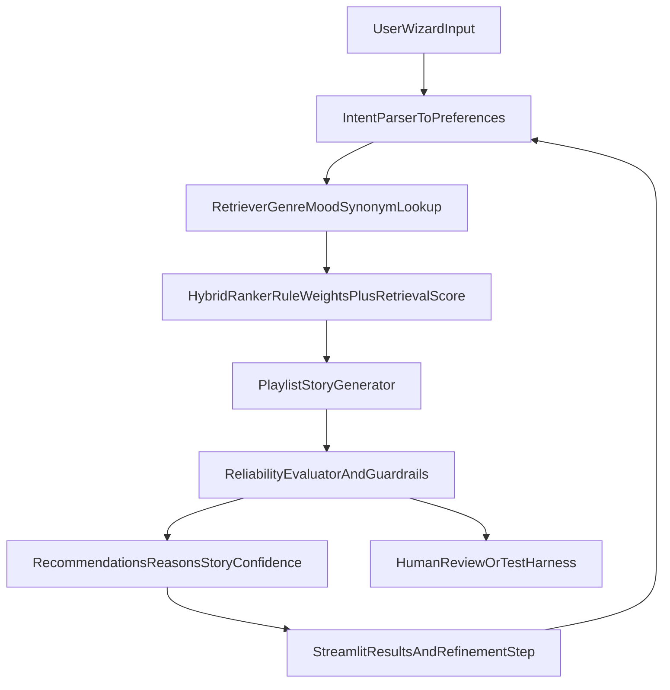

# AI DJ Copilot System Architecture

```mermaid
flowchart TD
  userInput[UserWizardInput] --> parser[IntentParserToPreferences]
  parser --> retrieval[RetrieverGenreMoodSynonymLookup]
  retrieval --> ranking[HybridRankerRuleWeightsPlusRetrievalScore]
  ranking --> storyGen[PlaylistStoryGenerator]
  storyGen --> evaluator[ReliabilityEvaluatorAndGuardrails]
  evaluator --> output[RecommendationsReasonsStoryConfidence]
  output --> ui[StreamlitResultsAndRefinementStep]
  ui --> parser
  evaluator --> humanCheck[HumanReviewOrTestHarness]
```

Export this diagram to PNG for your submission walkthrough if your grader prefers static assets.
